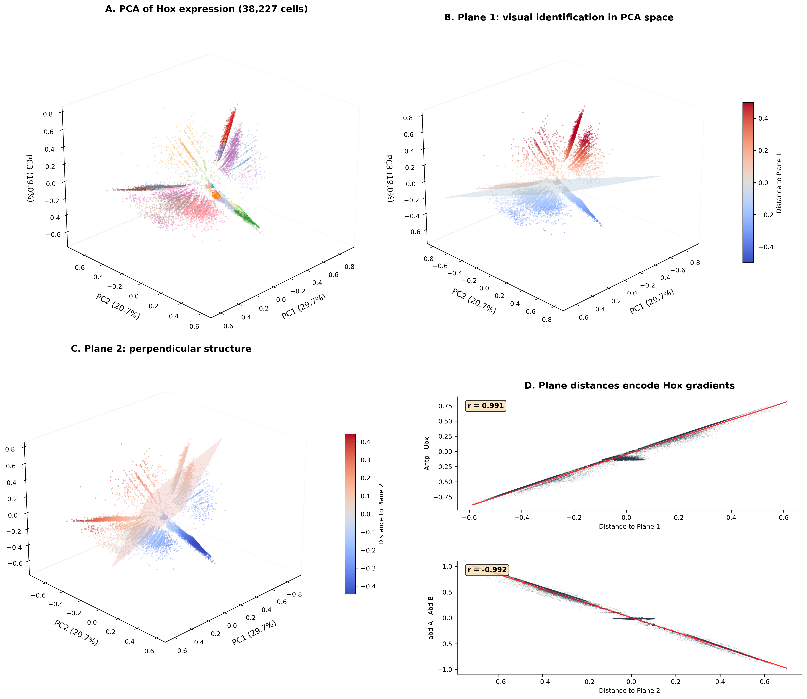
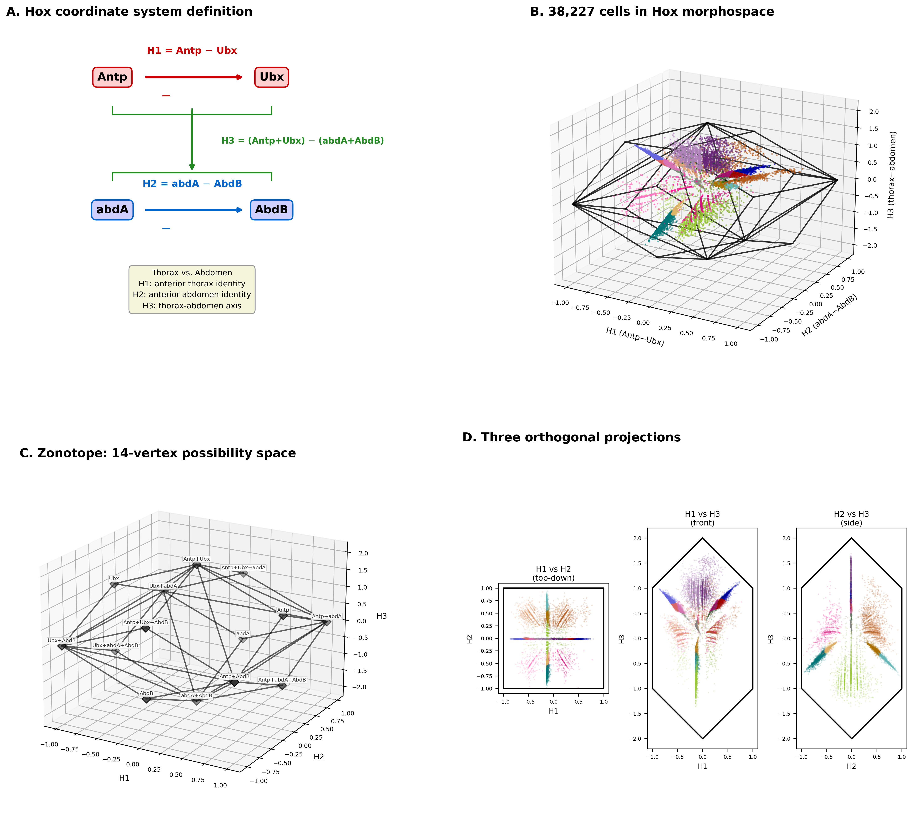
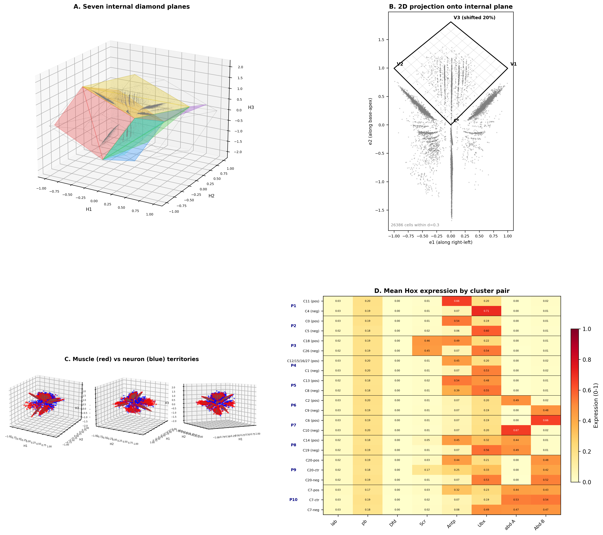
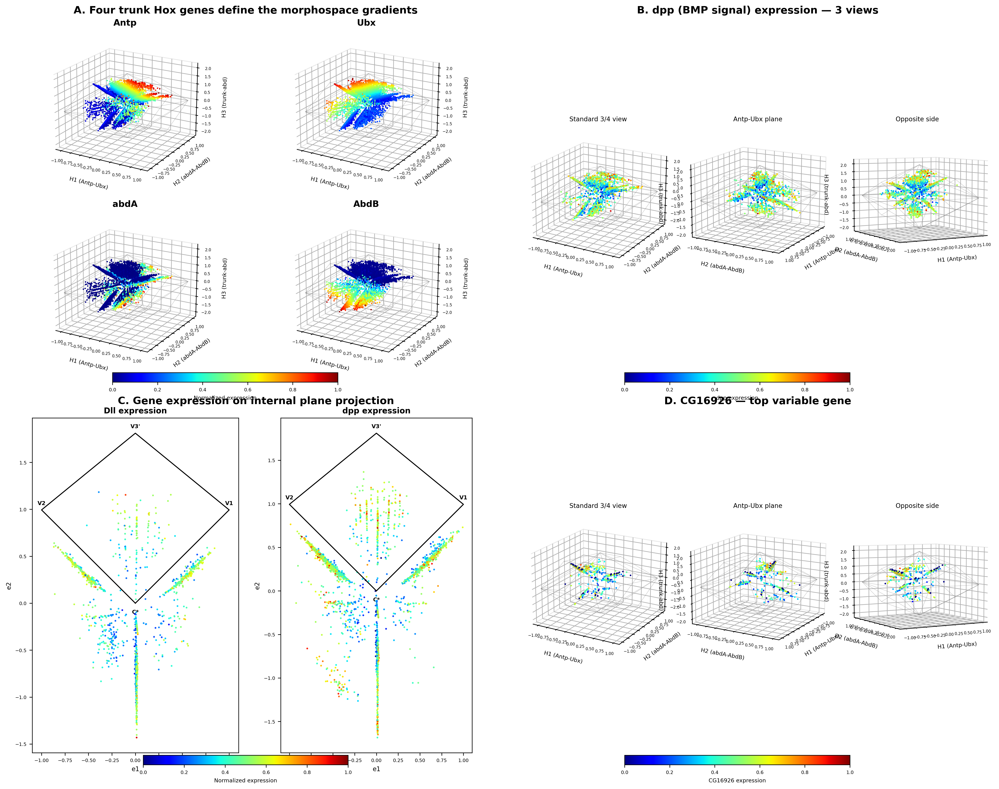

# Hox Morphospace Explorer: Geometric Structure of Cellular Identity in *Drosophila*

[](https://www.python.org/downloads/)
[](LICENSE)
[](https://flycellatlas.org/)

---

## Overview

This project analyzes 38,227 Hox-expressing cells from the [Fly Cell Atlas](https://flycellatlas.org/) --- a single-cell RNA-seq atlas of the adult *Drosophila melanogaster* body --- and constructs a **Hox Morphospace**: a three-dimensional coordinate system defined entirely by Hox gene expression that reveals the geometric structure of cellular identity.

The central finding is that Hox gene expression in adult *Drosophila* cells is not random, not spherical, and not uniformly distributed. Instead, cells occupy a bounded geometric shape called a **zonotope** --- a 14-vertex, 24-edge polytope that represents the theoretical envelope of all possible combinations of the four trunk Hox genes (Antp, Ubx, abd-A, Abd-B). Within this zonotope, cells cluster in specific regions that correspond to distinct cell types: 11,980 muscle cells and 8,271 neurons, for example, occupy non-overlapping territories defined by their Hox expression coordinates.

The project includes publication-quality figure generation scripts, detailed geometric analysis tools, and an interactive HTML-based explorer that allows real-time navigation of the morphospace with gene expression overlays, internal plane projections, and a searchable bank of 200 pre-embedded genes.

---

## The Discovery --- From PCA to Hox Coordinates

This section tells the story of how the Hox Morphospace was discovered, step by step, from an initial PCA analysis to a biologically grounded coordinate system.

### Step 1: PCA on 8 Hox Genes

We began with a standard principal component analysis on the expression of all 8 *Drosophila* Hox genes (`lab`, `pb`, `Dfd`, `Scr`, `Antp`, `Ubx`, `abd-A`, `Abd-B`) across 38,227 cells that express at least one Hox gene. Each gene was min-max normalized to [0, 1] before PCA. The first three principal components captured 69.4% of the total variance:

| Component | Variance Explained |
|-----------|-------------------|
| PC1       | 29.7%             |
| PC2       | 20.7%             |
| PC3       | 19.0%             |

The PCA scatter (Figure 1A) showed that cells did not fill a sphere or a blob --- there was visible geometric structure.

### Step 2: Visual Identification of Planar Structures

Rotating the 3D PCA scatter revealed something unexpected: cells appeared to lie on **flat structures** --- planes, not volumes. This was not subtle. Large subsets of cells formed disc-like arrangements in PCA space, visible to the eye when colored by leiden cluster identity.

We identified two such planes by selecting the leiden clusters that visually sat on each structure (Figure 1B, 1C):

- **Plane 1**: Thoracic/head clusters (clusters 0--6, 8--11, 13, 14, 17--19, and a merged group) forming the dominant flat disc.
- **Plane 2**: Abdominal clusters (clusters 21--26, 28--29, and sub-clusters of the split clusters 20 and 7) forming a second disc at an oblique angle.

The two planes met at an angle of **50.9 degrees**.

### Step 3: Measuring Plane Distances

We fit each plane via SVD and computed the signed distance of every cell to each plane. Cells near a given plane had distances close to zero; cells far away were displaced perpendicular to it.

### Step 4: The Key Discovery --- Planes Encode Hox Gradients

The breakthrough came when we correlated each cell's distance-to-plane with its Hox gene expression (Figure 1D):

- Distance to Plane 1 correlated strongly with **Antp minus Ubx** expression.
- Distance to Plane 2 correlated strongly with **abd-A minus Abd-B** expression.

This was not a weak statistical trend. The correlations were computed via SVM-derived boundary planes and confirmed with Pearson correlation. The planes in PCA space were not mathematical artifacts --- they encoded specific, interpretable Hox gene gradients. The data was revealing its own natural coordinate system.

### Step 5: Defining the Hox Coordinate System

This discovery motivated a coordinate transformation from abstract PCA space to a biologically meaningful Hox space. We defined three axes using the four trunk Hox genes:

```
H1 = Antp - Ubx          (anterior thorax identity)
H2 = abdA - AbdB         (anterior abdomen identity)
H3 = (Antp + Ubx) - (abdA + AbdB)   (thorax vs. abdomen axis)
```

- **H1** separates cells dominated by Antp (positive) from those dominated by Ubx (negative), capturing anterior-posterior patterning within the thorax.
- **H2** separates cells dominated by abd-A (positive) from those dominated by Abd-B (negative), capturing anterior-posterior patterning within the abdomen.
- **H3** separates thoracic cells (Antp + Ubx dominant, positive) from abdominal cells (abd-A + Abd-B dominant, negative).

### Step 6: The Zonotope Emerges

When all 38,227 cells were plotted in (H1, H2, H3) coordinates, they filled a bounded shape. We asked: what is the theoretical envelope of all possible Hox combinations? Since each of the four trunk Hox genes can independently range from 0 to 1, the set of all possible (H1, H2, H3) values forms the **Minkowski sum** of four line segments in 3D --- a geometric object known as a **zonotope**.

This zonotope has **14 vertices**, **24 edges**, and **6 faces**. Each vertex corresponds to a pure Hox gene state --- a corner of the 4-dimensional hypercube [0,1]^4 projected into Hox coordinate space. For example, the vertex where only Antp is maximally expressed maps to (H1, H2, H3) = (+1, 0, +1).

### Step 7: Cells Fill the Zonotope Non-Uniformly

The real data fills this zonotope non-uniformly. Cells cluster in specific regions that correspond to cell types, and large volumes of the possibility space are empty --- representing Hox combinations that no adult cell adopts. The morphospace is not just a coordinate system; it is a map of cellular identity.


*Figure 1. (A) PCA of Hox expression across 38,227 cells, colored by leiden cluster. (B) Plane 1 identified visually in PCA space; cells colored by signed distance to the fitted plane. (C) Plane 2, a second flat structure at 50.9 degrees to Plane 1. (D) Plane distances correlate with specific Hox gradients: distance to Plane 1 tracks Antp minus Ubx, distance to Plane 2 tracks abd-A minus Abd-B.*

---

## The Hox Morphospace

### Coordinate Axes

The morphospace is defined by three axes derived from the four trunk Hox genes, each min-max normalized to [0, 1]:

| Axis | Formula | Biological Meaning | Range |
|------|---------|--------------------|---------|
| H1   | `Antp - Ubx` | Anterior vs. posterior thorax | [-1, +1] |
| H2   | `abdA - AbdB` | Anterior vs. posterior abdomen | [-1, +1] |
| H3   | `(Antp + Ubx) - (abdA + AbdB)` | Thorax vs. abdomen | [-2, +2] |

### The Zonotope: Possibility Space

The zonotope is the Minkowski sum of four line segments in 3D, one for each trunk Hox gene. Geometrically, it is constructed by "sweeping" a line segment through space for each gene's contribution to the three axes:

- Antp contributes the vector (+1, 0, +1)
- Ubx contributes the vector (-1, 0, +1)
- abd-A contributes the vector (0, +1, -1)
- Abd-B contributes the vector (0, -1, -1)

The resulting polytope has:

| Property | Value |
|----------|-------|
| Vertices | 14    |
| Edges    | 24    |
| Faces    | 6 (parallelogram faces) |

Each vertex represents a **pure Hox state** --- a combination where each gene is either fully on (1) or fully off (0). Since 4 genes with 2 states each yield 16 corners of the hypercube, but the projection into 3D collapses some corners onto the same point, only 14 unique vertices remain. Vertices like "Antp only" (H1=+1, H2=0, H3=+1) or "abdA+AbdB" (H1=0, H2=0, H3=-2) have direct biological interpretations as extreme identity states.

The zonotope is the **possibility space** --- every achievable Hox coordinate lies inside or on its boundary. The real data fills only a subset of this space, and the pattern of filling encodes cell type identity.


*Figure 2. (A) Definition of the Hox coordinate system from the four trunk Hox genes. (B) 38,227 cells plotted in Hox morphospace, enclosed by the zonotope wireframe. (C) The 14-vertex zonotope with labeled vertices corresponding to pure gene states. (D) Three orthogonal projections (H1 vs H2, H1 vs H3, H2 vs H3) showing the 2D shadow of the morphospace.*

---

## Internal Geometry

### Diamond Planes

The zonotope is not just an outer shell. Its interior is sectioned by **7 internal diamond planes** --- flat quadrilateral surfaces that pass through the data, each defined by four vertices of the zonotope. These planes are parameterized by:

- **Apex** (C*): the polytope center at the origin [0, 0, 0]
- **Base**: a zonotope vertex, optionally shifted toward a neighboring vertex by a percentage (0--20%) to better align with cell density
- **Left** and **Right**: two additional zonotope vertices defining the plane's width

Each diamond plane slices the morphospace along a different angle, capturing a different combination of Hox gradients. The 7 planes defined in this analysis are:

| Plane | Apex | Base | Left | Right | Shift |
|-------|------|------|------|-------|-------|
| 1     | C*   | V3   | V2   | V1    | 0%    |
| 2     | C*   | V3   | V2   | V1    | 20% toward V7 |
| 3     | C*   | V5   | V1   | V4    | 10% toward V13 |
| 4     | C*   | V6   | V4   | V2    | 10% toward V14 |
| 5     | C*   | V10  | V2   | V8    | 20% toward V14 |
| 6     | C*   | V9   | V8   | V1    | 20% toward V13 |
| 7     | C*   | V12  | V8   | V4    | 0%    |

### 2D Plane Projection

Each diamond plane defines an orthonormal basis (e1, e2) and a normal direction. By projecting all cells onto this basis and filtering by distance to the plane (typically within a threshold of 0.3 units), we obtain a 2D view of the cells that live near that particular slice. A grid overlay (with adjustable cell size, default 0.15 units) subdivides the diamond into a coordinate system for fine-grained spatial analysis.

### Cell Type Territories

Different cell types occupy distinct, largely non-overlapping territories within the morphospace:

| Cell Type | Count | Morphospace Region |
|-----------|-------|--------------------|
| Muscle    | 11,980 | Concentrated in specific H1/H3 zones |
| Neuron    | 8,271 | Distinct territory, partially overlapping in H2 |

The spatial segregation of cell types in Hox coordinates confirms that Hox expression is not merely a marker of segmental origin but actively defines cellular identity in a geometric sense.

### Cluster Pairing

Leiden clustering in the morphospace reveals a pairing structure: clusters appear in matched pairs that are mirror images along the H1 axis (Antp-Ubx gradient). Each pair consists of a "positive" member (Antp-dominant) and a "negative" member (Ubx-dominant), with otherwise similar expression of the remaining Hox genes. Some original leiden clusters (e.g., cluster 20 and cluster 7) were split into sub-clusters based on their W-coordinate to resolve internal heterogeneity.


*Figure 3. (A) Seven internal diamond planes sectioning the zonotope, shown as colored surfaces within the wireframe. (B) 2D projection onto one internal plane, with diamond outline and grid overlay. (C) Muscle cells (red) and neurons (blue) occupy distinct territories in the morphospace, shown from three viewing angles. (D) Mean Hox expression heatmap for matched cluster pairs, confirming the mirror-image structure along H1.*

---

## Expression Landscapes

### Cardinal Hox Gradients

The four trunk Hox genes (Antp, Ubx, abd-A, Abd-B) create **cardinal gradients** across the morphospace. When each gene's expression is mapped as a color onto the 3D scatter, the result is a smooth, directional gradient aligned with the expected axis:

- **Antp** expression increases toward positive H1 and positive H3
- **Ubx** expression increases toward negative H1 and positive H3
- **abd-A** expression increases toward positive H2 and negative H3
- **Abd-B** expression increases toward negative H2 and negative H3

These gradients are not imposed --- they emerge directly from the coordinate definition and confirm its geometric consistency.

### Non-Hox Gene Expression

Beyond the Hox genes themselves, signaling pathway genes and transcription factors show structured spatial patterns in the morphospace:

- **dpp** (BMP signaling): expressed in localized regions, visible from multiple viewing angles as discrete clusters rather than smooth gradients
- **Dll** (Distal-less): shows distinct expression domains when projected onto internal planes
- **hh**, **vg**: additional signaling and selector genes with structured morphospace distributions

The top variable non-Hox gene across all 38,227 Hox-expressing cells is **CG16926** (variance = 1.74), which shows its own spatial structure within the zonotope.

### Plane Projector: Revealing Hidden Structure

The 2D plane projection is particularly powerful for visualizing non-Hox gene expression. Structure that is invisible in the full 3D view --- because it is embedded within a thin slice of the morphospace --- becomes clearly visible when projected onto the appropriate internal plane. The diamond grid provides a natural coordinate system for quantifying expression patterns within each slice.


*Figure 4. (A) The four trunk Hox genes mapped onto the morphospace, each showing a cardinal gradient. (B) dpp (BMP signal) expression from three viewing angles, revealing localized expression domains. (C) Dll and dpp expression projected onto an internal diamond plane, showing fine structure invisible in 3D. (D) CG16926, the top variable non-Hox gene, displayed from three viewing angles.*

---

## Interactive Explorer

The **Hox Morphospace Explorer** is a self-contained HTML file generated by `generate_morphospace_hoxaxes.py`. It provides an interactive interface for navigating the morphospace in real time.

**[Launch the Explorer](https://drsiyarb.github.io/hox-morphospace/)** *(hosted via GitHub Pages)*

### Layout

The explorer uses a 5-column layout:

| Column | Content | Description |
|--------|---------|-------------|
| 1 (main) | 3D scatter plot | Interactive Plotly 3D view of all 38,227 cells in Hox coordinates, with zonotope wireframe |
| 2 | 3D control panels | Toggle layers: cells by cluster, cell type coloring, zonotope wireframe, vertex labels, diamond planes |
| 3 | 2D Plane Projector | Real-time projection of cells onto any selected internal diamond plane |
| 4 | Projector controls | Plane selector, grid cell size, distance threshold slider, colorscheme picker |
| 5 | Expression matrix | Hox expression heatmap for all cluster pairs |

### Key Features

- **Layer toggles**: Show/hide individual cell clusters, zonotope geometry, bounding box, and all 7 diamond planes independently.
- **Gene search**: Search across 200 pre-embedded genes (selected by variance). Selecting a gene overlays its expression on both the 3D scatter and the 2D plane projector simultaneously.
- **Expression cutoff sliders**: Adjust minimum expression thresholds to filter low-expressing cells in real time.
- **Universal colorscheme selector**: Switch between 5 color scales (Jet, Viridis, Inferno, Turbo, Cividis) applied globally to all gene expression overlays.
- **Plane projector**: Select any of the 7 internal diamond planes and see all nearby cells projected onto a 2D diamond coordinate system. Adjustable distance threshold controls which cells appear. Grid overlay with configurable cell size.
- **Cluster pair matrix**: A compact heatmap showing mean Hox gene expression for every cluster pair, revealing the mirror-image structure along H1.

<!-- Add a screenshot of the explorer here -->
<!--  -->

---

## Code Structure

### Core Scripts

| Script | Description |
|--------|-------------|
| `generate_morphospace_hoxaxes.py` | **Main script.** Loads the Fly Cell Atlas h5ad, computes Hox coordinates, builds the zonotope, constructs all 7 diamond planes, embeds 200 variable genes, and generates the interactive HTML explorer. |
| `fig1_pca_to_planes.py` | Figure 1: PCA analysis, visual plane identification, SVD plane fitting, SVM boundary planes, and distance-to-Hox-gradient correlation. |
| `fig2_hox_morphospace.py` | Figure 2: Hox coordinate system diagram, 3D morphospace scatter with zonotope, labeled vertices, and three orthogonal projections. |
| `fig3_geometry_celltypes.py` | Figure 3: Internal diamond planes, 2D plane projection with grid, muscle/neuron territory visualization, and cluster-pair Hox heatmap. |
| `fig4_expression_landscapes.py` | Figure 4: Trunk Hox gene gradients, dpp expression from multiple views, gene expression on internal planes, and top variable non-Hox gene identification. |

### Analysis Scripts

| Script | Description |
|--------|-------------|
| `generate_plane_analysis.py` | Detailed analysis of cell distributions on each diamond plane projection. |
| `generate_allplanes_genes.py` | Gene expression analysis across all 7 internal planes. |
| `analyze_plane_organ_enrichment.py` | Organ/tissue enrichment analysis within plane-proximal cell populations. |
| `analyze_plane_volumes.py` | Volumetric analysis of cell density within the zonotope. |
| `analyze_pg_separation.py` | Paralog group separation analysis in Hox coordinates. |
| `analyze_organ_confusion.py` | Analysis of how well Hox coordinates distinguish organ types. |
| `generate_hierarchical_svm.py` | Hierarchical SVM classification of cell types in the morphospace. |
| `generate_possibility_space.py` | Construction and analysis of the zonotope possibility space. |

### Visualization Scripts

| Script | Description |
|--------|-------------|
| `generate_pca.py`, `generate_pca_3d.py` | PCA visualizations in 2D and 3D. |
| `generate_leiden_3d.py` | 3D scatter colored by leiden clusters. |
| `generate_3views.py`, `generate_3views_correspondence.py` | Multi-view 3D visualizations with cluster correspondence. |
| `generate_combined_3d_heatmap.py` | Combined 3D visualization with Hox expression heatmaps. |
| `generate_morphospace_hulls.py` | Convex hull analysis per cluster. |
| `generate_hox_heatmap.py`, `print_hox_matrix.py` | Hox expression heatmaps and tabular output. |

### Blender Integration

| File | Description |
|------|-------------|
| `export_to_blender.py` | Exports morphospace data to CSV files for Blender 3D rendering. |
| `blender_import.py` | Blender import script — rebuilds the full scene from exported CSVs. |
| `hox_morphospace_addon.zip` | **Unified Blender addon (v2.0)** — install via Edit > Preferences > Add-ons > Install. Contains four panels in the "Hox Morphospace" sidebar tab: |

The addon provides:
- **Scene Builder** — One-click import of the full morphospace from CSV files (cells, polytope, lines, centers). Reads `blender_cells.csv`, `blender_polytope.csv`, `blender_polytope_edges.csv`, and `blender_lines.csv` exported by `export_to_blender.py`. Creates Cells, Polytope, Planes, Lines, Centers, BoundingBoxes, and Lighting collections with configurable cell size, edge width, and vertex size.
- **Plane Creator** — Generate stripe patterns on internal diamond planes with configurable colors, step size, and shift toward zonotope vertices.
- **Cell Layers** — Create toggleable cell type layers from annotation metadata (organ, sex, cluster). Select a metadata column and value to highlight matching cells.
- **Gene Expression Painter** — Paint gene expression gradients onto the morphospace with customizable color ramps, expression cutoffs, and 12-bin binning. Supports 15 curated genes (8 Hox + 7 TF/signaling) and extraction of any custom gene from the h5ad via system Python.

---

## Reproducing the Analysis

### Requirements

- Python 3.10+
- Core dependencies:

```
scanpy>=1.9
numpy>=1.24
scipy>=1.10
scikit-learn>=1.2
pandas>=1.5
matplotlib>=3.7
plotly>=5.15
```

Install all dependencies:

```bash
pip install scanpy numpy scipy scikit-learn pandas matplotlib plotly
```

### Data

The analysis uses the **Fly Cell Atlas** 10x body dataset from the Chan Zuckerberg Biohub:

1. Download `s_fca_biohub_body_10x.h5ad` from [https://flycellatlas.org/](https://flycellatlas.org/)
2. Place it in your working directory (or update `H5AD_PATH` in the scripts)

The dataset contains single-cell RNA-seq data from the adult *Drosophila melanogaster* body, with cell type annotations in `adata.obs['annotation_broad']` and `adata.obs['annotation']`.

### Steps

1. **Generate the morphospace CSV** (intermediate data with Hox coordinates and cluster labels):
   ```bash
   python generate_morphospace_hoxaxes.py
   ```
   This produces `hox_morphospace_boxcentered.csv` and the interactive HTML explorer.

2. **Generate publication figures**:
   ```bash
   python fig1_pca_to_planes.py
   python fig2_hox_morphospace.py
   python fig3_geometry_celltypes.py
   python fig4_expression_landscapes.py
   ```
   All figures are saved to the `figures/` directory at 300 DPI.

3. **Run additional analyses** (optional):
   ```bash
   python generate_plane_analysis.py
   python analyze_plane_organ_enrichment.py
   ```

### Output

| Output | Location |
|--------|----------|
| Interactive explorer | `hox_morphospace_explorer.html` |
| Intermediate data | `hox_morphospace_boxcentered.csv` |
| Figure 1 | `figures/fig1_pca_to_planes.png` |
| Figure 2 | `figures/fig2_hox_morphospace.png` |
| Figure 3 | `figures/fig3_geometry_celltypes.png` |
| Figure 4 | `figures/fig4_expression_landscapes.png` |

---

## Key Numbers

| Metric | Value |
|--------|-------|
| Total Hox-expressing cells | 38,227 |
| Hox genes analyzed | 8 (lab, pb, Dfd, Scr, Antp, Ubx, abd-A, Abd-B) |
| PCA variance (PC1/PC2/PC3) | 29.7% / 20.7% / 19.0% |
| Angle between PCA planes | 50.9 degrees |
| Zonotope vertices | 14 |
| Zonotope edges | 24 |
| Zonotope faces | 6 |
| Internal diamond planes | 7 |
| Muscle cells | 11,980 |
| Neurons | 8,271 |
| Pre-embedded genes (explorer) | 200 |
| Top variable non-Hox gene | CG16926 (variance = 1.74) |

---

## Citation

If you use this work, please cite:

```
[Citation placeholder — to be updated upon publication]
```

---

## References

### Data Source

1. Li, H. *et al.* Fly Cell Atlas: A single-nucleus transcriptomic atlas of the adult fruit fly. *Science* **375**, eabk2432 (2022). https://doi.org/10.1126/science.abk2432

### Hox Gene Biology

2. Lewis, E. B. A gene complex controlling segmentation in *Drosophila*. *Nature* **276**, 565–570 (1978). https://doi.org/10.1038/276565a0
3. McGinnis, W. & Krumlauf, R. Homeobox genes and axial patterning. *Cell* **68**, 283–302 (1992). https://doi.org/10.1016/0092-8674(92)90471-N
4. Kaufman, T. C., Seeger, M. A. & Olsen, G. Molecular and genetic organization of the Antennapedia gene complex of *Drosophila melanogaster*. *Advances in Genetics* **27**, 309–362 (1990). https://doi.org/10.1016/S0065-2660(08)60029-2
5. Lawrence, P. A. *The Making of a Fly: The Genetics of Animal Design*. Blackwell Scientific Publications (1992).

### Geometry and Polytope Theory

6. Ziegler, G. M. *Lectures on Polytopes*. Springer Graduate Texts in Mathematics **152** (1995). https://doi.org/10.1007/978-1-4613-8431-1
7. McMullen, P. The maximum numbers of faces of a convex polytope. *Mathematika* **17**, 179–184 (1970). https://doi.org/10.1112/S0025579300002850

### Software

8. Wolf, F. A., Angerer, P. & Theis, F. J. SCANPY: large-scale single-cell gene expression data analysis. *Genome Biology* **19**, 15 (2018). https://doi.org/10.1186/s13059-017-1382-0
9. Pedregosa, F. *et al.* Scikit-learn: Machine learning in Python. *Journal of Machine Learning Research* **12**, 2825–2830 (2011).
10. Traag, V. A., Waltman, L. & van Eck, N. J. From Louvain to Leiden: guaranteeing well-connected communities. *Scientific Reports* **9**, 5233 (2019). https://doi.org/10.1038/s41598-019-41695-z
11. Plotly Technologies Inc. *Collaborative data science*. https://plotly.com (2015).

---

## License

This project is released under the [MIT License](LICENSE).

---

## Acknowledgments

This work uses data from the [Fly Cell Atlas](https://flycellatlas.org/) generated by the Chan Zuckerberg Biohub. The geometric analysis of Hox expression space builds on the foundational work of Edward B. Lewis on the bithorax complex and decades of *Drosophila* developmental genetics establishing the role of Hox genes in body plan specification.
